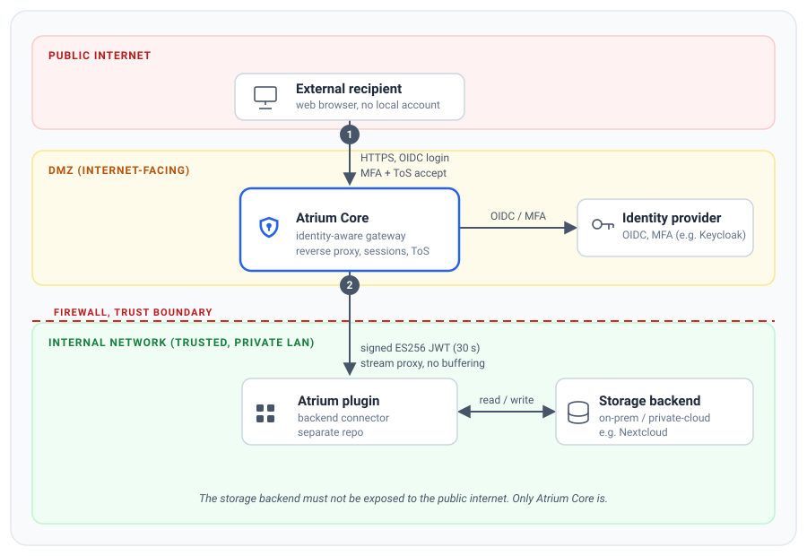

# Atrium Secureshare Core

**Identity-aware secure gateway for external file sharing.** Atrium lets people
outside your organisation download and upload files from on-prem or
private-cloud storage, without needing to expose that storage to the public
internet and without provisioning the external people as accounts in it.

External recipients authenticate against your own OIDC identity provider and only then do they reach the files shared *with them*. The files are streamed through the gateway, which is the only
component that needs to face the internet. This repository is the **core
gateway** (Go backend plus React frontend). The storage side is a small,
backend-specific plugin. Nextcloud is the first supported backend, delivered by
[atrium-plugin-nextcloud](https://github.com/atrium-secureshare/atrium-plugin-nextcloud);
other backends are a matter of writing another plugin.

## How it works



1. An external recipient opens their share link and is redirected to your
   **OIDC identity provider** (for example Keycloak). Atrium never holds their
   credentials.
2. In the recommended deployment, Atrium Core sits in the **DMZ** as the only
   internet-facing component. For each file it opens a short-lived, signed
   **ES256** channel across the firewall to the storage plugin and **streams**
   the bytes through. Nothing is buffered, so the storage backend can stay in the
   trusted internal network.

## Features

- **Identity-bound external sharing.** There are no anonymous public links. Every
  share is addressed to a specific recipient by email, and access requires that
  person to authenticate.
- **OIDC first.** Authentication and credential management are delegated
  entirely to an upstream OpenID Connect provider.
- **Optional policy acceptance.** Recipients can be required to accept a
  configured Terms of Service, shown as a blocking consent gate, before any
  file is served. This is opt-in and can also be delegated to the identity
  provider instead.
- **Optional MFA enforcement.** Atrium can require multi-factor authentication,
  matching the session's `acr` claim against a configured set of accepted values
  and failing the login otherwise.
- **Granular share attributes.** Shares carry expiry dates and maximum-download
  caps, combined with scope-specific access:
  - **File shares** are read-only downloads.
  - **Folder shares** support four modes: `Read-Only`, `Write / Read-Own` (upload
    and see only your own uploads), `Write / Read-All`, and `Write-Only`, a
    dropzone where you upload with no visibility into the folder.
- **Streaming proxy.** Downloads and uploads pass through without buffering, so
  large files do not cost the gateway memory.
- **Audit trail.** Access events (login, consent, download and upload start,
  denials, expiry) are emitted as structured logs with pseudonymised recipient
  identities.
- **White-label.** The brand name, accent colour, theme and logos are applied at
  runtime. The shipped build carries neutral Atrium defaults.

## Why Atrium

### Hardened security and network isolation
The storage backend does not need to face the public internet. Atrium acts as the
reverse proxy in the DMZ, so you can keep the backend in the internal network
behind the firewall. If Atrium is compromised, the storage network stays
protected.

### Zero platform licensing overhead
External recipients are never provisioned as accounts in the storage backend, so
they add no licensing cost there. With a Nextcloud backend, for example, you
avoid the guest accounts that its Guests app would otherwise create.

### No account impersonation, no directory pollution
Because guests are never objects in the storage user directory, they cannot spoof
internal employees in a global address book, and the directory does not fill up
with stale external accounts.

### Storage-agnostic
The gateway talks to storage over a small, versioned JSON contract. A different
backend is a different plugin behind the same contract, never a change in the
core.

### White-label by design
Atrium is meant to run under *your* brand. It ships with neutral Atrium defaults
and is rebranded entirely **at runtime**, covering the brand name, sub-label,
accent colour, light or dark theme and logos, with no rebuild and no fork. Logos
are mounted files served under `/branding/` and picked up without a restart, so
external recipients never see the word "Atrium" unless you leave the defaults in
place. See [docs/configuration.md](docs/configuration.md) for the branding
options.

## Quickstart (local)

```bash
go build ./cmd/atrium        # compile
go test ./...                # unit tests
ATRIUM_ADDR=:8080 go run ./cmd/atrium
curl localhost:8080/healthz  # -> ok
```

The frontend lives in `web/` (React, TypeScript, Vite). See
[AGENTS.md](AGENTS.md) for the build and test commands.

Atrium is configured entirely through environment variables, covering OIDC,
sessions, the storage plugin trust key and branding. The full reference, together
with the one-time trust-key setup and the Terms-of-Service and branding options,
is in **[docs/configuration.md](docs/configuration.md)**.

## Documentation

- [docs/deployment.md](docs/deployment.md) is the minimal how-to for running the
  gateway as a container, with example Docker Compose and Kubernetes manifests
  and the one-time provider trust-key setup.
- [docs/configuration.md](docs/configuration.md) documents the environment
  variables, the Terms-of-Service gate, white-label branding and the provider
  trust setup.
- [docs/architecture.md](docs/architecture.md) records the security-relevant
  invariants, namely the `/api/` routing boundary, hardening headers and CSP, the
  audit trail and the core-to-storage trust protocol.
- [AGENTS.md](AGENTS.md) covers the repository layout and the build, test and
  commit workflow for contributors and coding agents.

## Related repositories

- **[atrium-plugin-nextcloud](https://github.com/atrium-secureshare/atrium-plugin-nextcloud)**
  is the Nextcloud storage plugin. Atrium needs one storage plugin to do anything
  useful.
